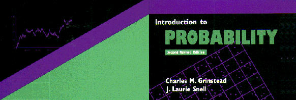

# Introduction to Probability

Clone of the (now open-sourced) Grinstead and Snell 1998 "Introduction to probability" book and related computer algorithms.

Book: GNU Free documentation Licence (FDL)

Implementation of the computer algorithms:
- Julia language: MIT Licence

The original home-page of the book (seems no longer maintained) is [still available](http://www.dartmouth.edu/~chance/teaching_aids/books_articles/probability_book/book.html).
